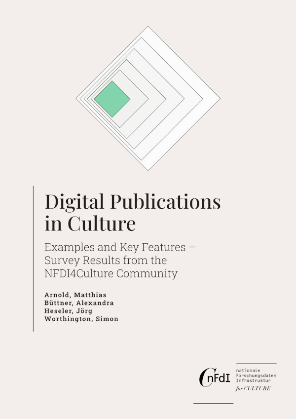

## Digital Publications in Culture: Examples and Key Features – Survey Results from the NFDI4Culture Community

by Matthias Arnold, Alexandra Büttner, Jörg Heseler, and Simon Worthington

v1.0

 > German translation: Digitale Publikationen im Kulturbereich: Beispiele und Eigenschaften – Umfrageergebnisse aus der NFDI4Culture Community

<picture>
 <source media="(prefers-color-scheme: dark)" srcset="cover/cover-small.jpg">
 <source media="(prefers-color-scheme: light)" srcset="cover/cover-small.jpg">
 
</picture>
